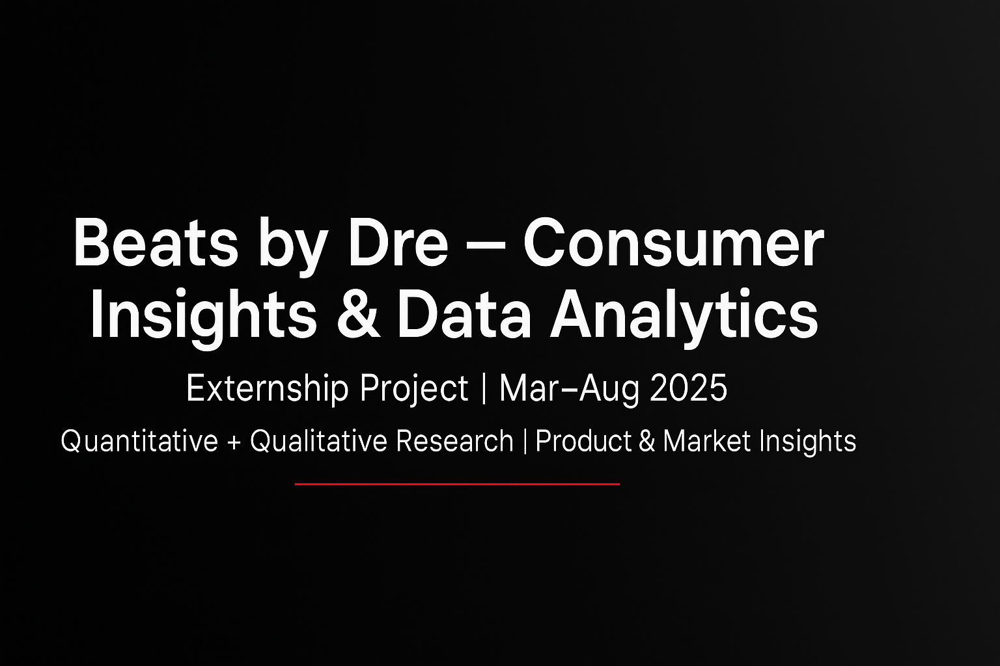

# 🎧 Beats by Dre — Consumer Insights & Data Analytics

### Externship Project · Mar–Aug 2025  
**Focus:** Consumer Behavior · Market Analysis · Product Intelligence · Data Visualization

---

## 📘 Overview
This project was completed as part of the **Beats by Dre Consumer Insights & Data Analytics Externship**, where I analyzed **quantitative survey data** and **qualitative feedback** to uncover behavioral patterns, sentiment drivers, and product perception insights for Beats audio products.

---

## 🎯 Objectives
- Identify key purchase motivations and brand perception factors among consumers.  
- Perform quantitative analysis of survey responses to reveal statistical trends.  
- Conduct qualitative sentiment and theme analysis to decode consumer narratives.  
- Visualize data through dashboards and present actionable recommendations.

---

## 🧠 Methodology

| Type | Tools | Description |
|------|--------|-------------|
| **Quantitative Analysis** | Google Sheets · Excel · Python | Processed survey data, calculated descriptive statistics, visualized frequency & correlation trends. |
| **Qualitative Analysis** | Google Sheets · Sentiment Coding | Identified recurring themes, sentiment categories, and key drivers of brand loyalty. |
| **Visualization & Reporting** | Gamma Deck · ManyChat · Claude | Created an interactive dashboard summarizing insights and presentation-ready visuals. |

---

## 📊 Key Insights

- **Top purchase drivers:** Audio quality, comfort, and brand prestige.  
- **Main friction:** Price sensitivity among mid-tier audience segments.  
- **Qualitative themes:** Colorways, fit, and product style strongly impact gifting decisions.  
- **Sentiment:** 76% positive tone across feedback, highlighting Beats as an “aspirational lifestyle brand.”  

---

## 📈 Deliverables

| Artifact | Description | Link |
|-----------|--------------|------|
| 📑 Quantitative Analysis | Structured survey dataset, summary tables, and descriptive stats. | [Google Sheets](https://docs.google.com/spreadsheets/d/1yBEFhBWfudctf846BmD4IqbEORIWsOwkXRAyOymv1RA/edit?usp=sharing) |
| 💬 Qualitative Analysis | Thematic coding and sentiment matrix. | [Google Sheets](https://docs.google.com/spreadsheets/d/1yBEFhBWfudctf846BmD4IqbEORIWsOwkXRAyOymv1RA/edit?gid=372544226#gid=372544226) |
| 📊 Presentation Deck | Executive summary for stakeholders. | [Google Doc Presentation](https://docs.google.com/document/d/1xlIidDuUc6Ew5313CBGiE8d35diXrKM2Dbn-qfp-tGE/edit?usp=sharing) |
| 🧭 Dashboard | Visual exploration of consumer sentiment and behavior. | [Gamma Deck](https://gamma.app/docs/Exploring-Consumer-Preferences-and-Behaviors-for-Beats-by-Dre-0j3zvfgf83lnwht) |
| 🤖 Claude Artifact | AI-assisted insights and dashboard artifact. | [Claude Artifact](https://claude.site/artifacts/465ec87b-0355-4f2f-a09a-32af47e8d62f) |

---

